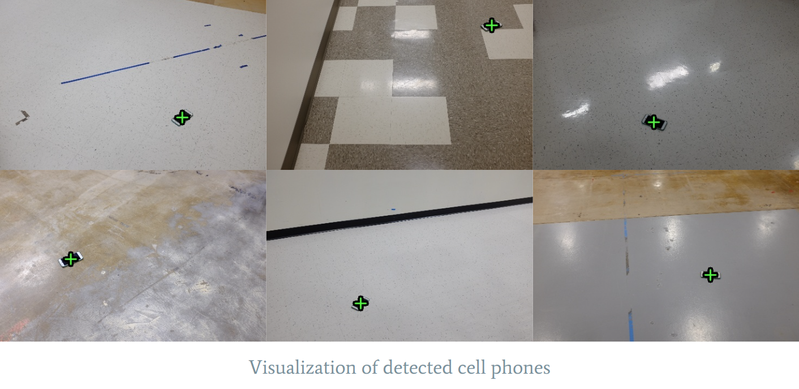

# find_phone
A simple detector to find phones on the floor and report their coordinates in the image frame.




## Usage
1. Install dependencies:
```pip install -r requirements.txt```

2. Train a new model:
```
cd find_phone
```
###### Note that this will overwrite the pretrained model, skip this step for using the pretrained model
```
python train_phone_finder.py path_to_dataset_folder
```

3. Perform inference:
```
python find_phone.py path_to_image.jpg
```

(Optional) Perform inference on a folder:
```
python find_phone.py path_to_folder
```

(Optional) Perform inference with visualization: 
```
python find_phone.py path_to_image.jpg --visualize
```


#### Assumptions
Since the dataset does not contain information regarding the size of the phones, they were assumed to occupy about 10% of the image.
Additionally, it was assumed that only a single phone exists in the image. These assumptions were made based on the images provided in the dataset.

#### Improvements / Future Work
If we are interested in detecting phones of various sizes we can do one or more of the following:
- We can use a model that predicts a heatmap, or just x, y coordinates instead of a set of bounding boxes
- Alternatively we could use augmentation techniques like cropping and padding, or pasting the phones onto a variety of backgrounds to add different sized phones to our dataset

If we are interested in detecting multiple phones, we can combine a set of training images into a single image, similar to YOLO's mosaic augmentation. 
That being said, YOLO does some of this under the hood anyway so it might accurately detect multiple phones already. 
